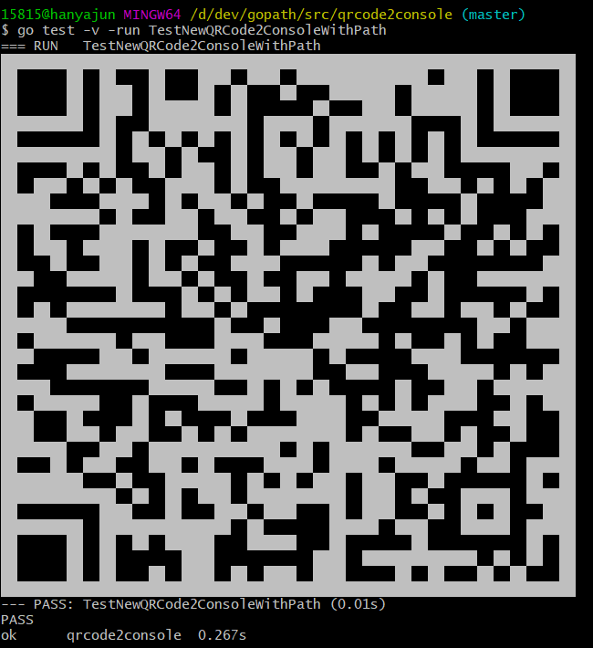
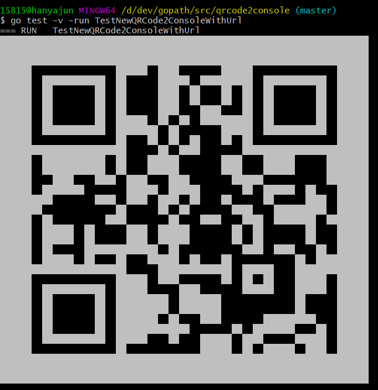

### qrcode2console
链接生成二维码输出到console或者是二维码图片输出到console
### 安装
```go
go get -u github.com/Han-Ya-Jun/qrcode2console
```
### 示例
```go
func TestNewQRCode2ConsoleWithUrl(t *testing.T) {
	qr := NewQRCode2ConsoleWithUrl("https://hanyajun.com", true)
	//qr.Debug()
	qr.Output()
}

func TestNewQRCode2ConsoleWithPath(t *testing.T) {
	qr := NewQRCode2ConsoleWithPath("qrcode.jpg")
	//qr.Debug()
	qr.Output()
}
```
### 效果

